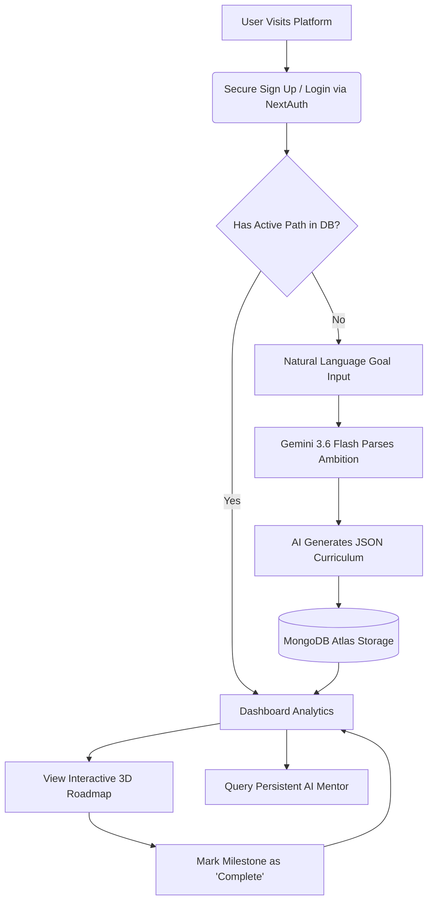
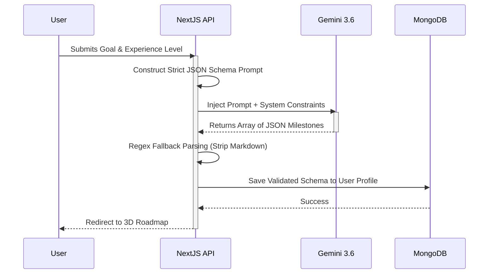
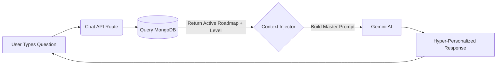

<div align="center">
  
  <h1>🚀 LearnSync AI</h1>
  <p><strong>Your Ultra-Personalized, AI-Powered Learning Companion</strong></p>
  
  [](https://learnsync-56nlakpb4-krishnaadubey2005-8466s-projects.vercel.app)
  
  <div>
    
    
    
    
    
  </div>
</div>

---

<div align="center">
  <table>
    <tr>
      <td align="center">
        <h3>🏆 Official Submission for HCLTech AMPlified</h3>
        <p><strong>Season 1 • 2026 | The AI Challenge</strong></p>
        <p><i>"Build. Compete. Learn. Rise."</i></p>
        <p>This project was proudly conceptualized, designed, and engineered by team <b>KineticModifiers</b> for the Round 2 PathFinder Prototype challenge. We set out to compete against the brightest minds by solving a critical problem in modern education using cutting-edge Generative AI.</p>
      </td>
    </tr>
  </table>
</div>

---

## 🌟 The Problem & Our Solution

**The Problem:** The internet has democratized education, but it has also created **"choice paralysis"**. Beginners are overwhelmed by thousands of courses and scattered YouTube videos. Without a personal mentor, students often learn the wrong skills, lose motivation, and quit.

**The Solution:** LearnSync AI acts as a highly intelligent, 24/7 personal mentor. It dynamically generates **personalized, step-by-step learning roadmaps** based on a user's exact interests, current experience level, and ultimate career goals. LearnSync curates hyper-specific milestones, tracks progress in real-time, and provides an integrated AI chat interface to explain complex concepts natively.

---

## 🏗️ Interactive Architecture & Workflows

To ensure high performance, responsiveness, and secure data handling, we engineered a scalable, full-stack application. Below are the architectural workflows that power LearnSync.

### 1. User Journey & Core Loop
This flowchart maps how a user moves from an initial idea to executing a structured curriculum.



### 2. Intelligent Onboarding Generation
How we force a Large Language Model to return structured, predictable data for our UI.



### 3. Context-Aware Mentor Workflow (RAG-Lite)
How the chat assistant "knows" exactly what the user is currently learning without being explicitly told.



---

## 🛠️ Deep Dive: Features & UX Decisions

<details>
<summary><b>1. 🧠 Dynamic AI Onboarding & Goal Parsing</b> (Click to expand)</summary>
Users bypass complex forms and describe their career ambitions in natural language. This data is sent to a custom Next.js API route where it is packaged into a highly specific prompt. The prompt is processed by Google's cutting-edge `gemini-3.6-flash` AI model, which generates a strictly typed JSON structure containing a comprehensive, multi-step curriculum.
</details>

<details>
<summary><b>2. 🗺️ Interactive 3D Roadmap Generation</b> (Click to expand)</summary>
We built a visually stunning, Framer Motion-powered timeline. The timeline visually "draws" itself as you load the page, and milestone cards pop into view sequentially. Each milestone contains theoretical concepts, actionable resources, and an estimated time to completion.
</details>

<details>
<summary><b>3. 💬 Context-Aware AI Mentor</b> (Click to expand)</summary>
Learning isn't just about reading; it's about asking questions. When a user asks a question, the API silently queries MongoDB for their exact learning path and injects this context into the system prompt. The AI Mentor answers questions specifically tailored to the user's skill level.
</details>

<details>
<summary><b>4. 🔒 Secure Authentication & Data Persistence</b> (Click to expand)</summary>
Security is handled via `NextAuth.js`. Passwords are fully hashed and salted using `bcryptjs`. We use JWT (JSON Web Tokens) to securely maintain the user's session state across the application, tying their unique `ObjectId` directly to their roadmaps in MongoDB.
</details>

<details>
<summary><b>5. ✨ Premium Glassmorphism UI & Physics</b> (Click to expand)</summary>
To stand out in the HCLTech challenge, the UI had to be flawless. The dark mode features a mesmerizing, physics-simulated Aurora Glowing Mesh. Components scale slightly on interaction, projecting deep shadows and reflecting the glowing background, achieving seamless 60fps performance without heavy WebGL.
</details>

---

## 🚀 Local Installation & Setup

Want to run LearnSync's architecture on your own machine? Follow these simple steps:

### 1. Clone the Repository
```bash
git clone https://github.com/krrish-cypto/learnsync-ai.git
cd learnsync-ai
```

### 2. Install Dependencies
```bash
npm install
```

### 3. Setup Environment Variables
Create a `.env` file in the root directory and add the following required keys:
```env
# MongoDB Connection String (Set up a free cluster on MongoDB Atlas)
MONGODB_URI="mongodb+srv://<username>:<password>@cluster0.mongodb.net/learnsync"

# Google Gemini API Key (Get from Google AI Studio)
GEMINI_API_KEY="your-gemini-api-key"

# NextAuth Secret (Used for JWT Encryption)
NEXTAUTH_SECRET="your-super-secret-key"
```

### 4. Start the Development Server
```bash
npm run dev
```
Open [http://localhost:3000](http://localhost:3000) in your browser. The application will automatically connect to your database and initialize the AI configurations.

---

<div align="center">
  <h3>Engineered for the HCLTech AMPlified Challenge by</h3>
  <h2>🚀 KineticModifiers</h2>
</div>
