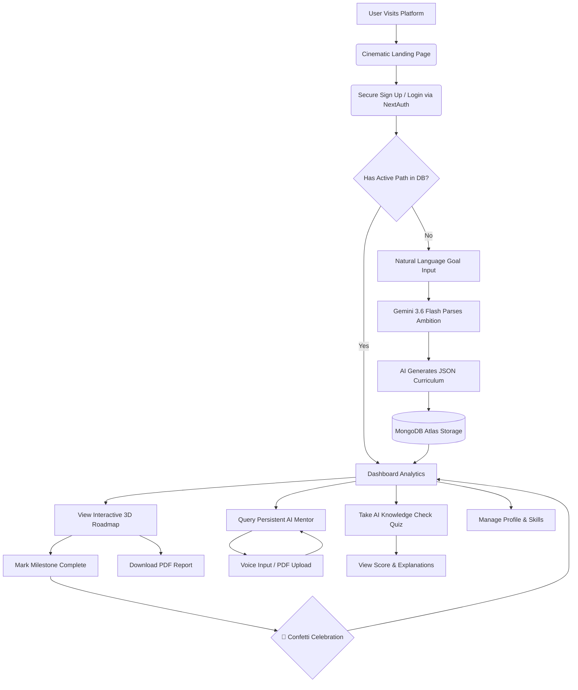
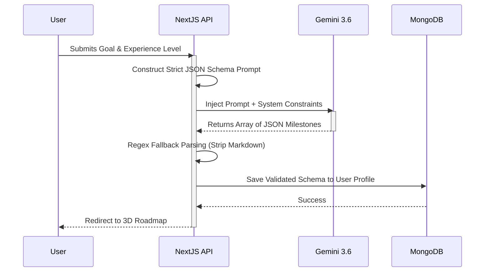
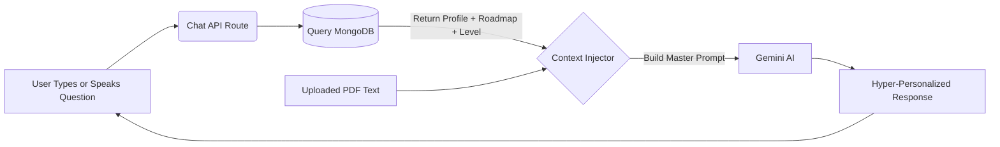
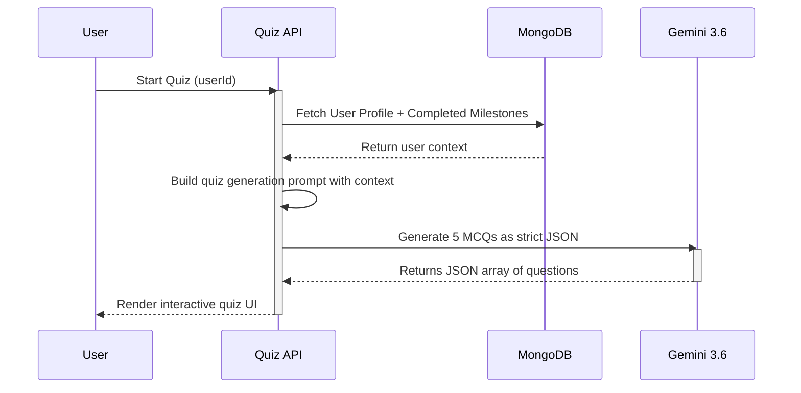
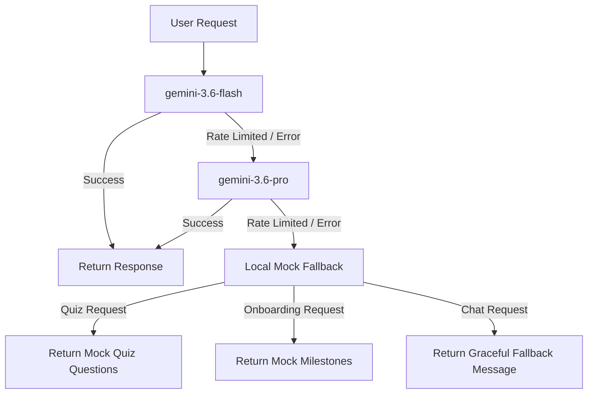
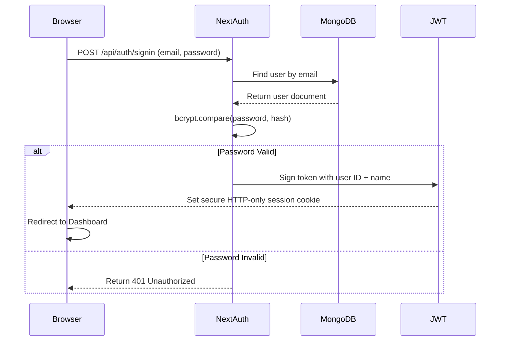
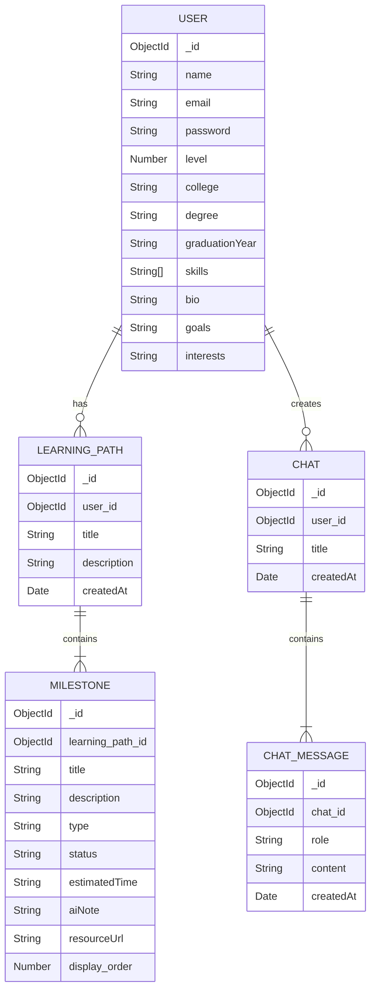

<div align="center">
  
  <h1>🚀 LearnSync AI</h1>
  <p><strong>Your Ultra-Personalized, AI-Powered Learning Companion</strong></p>
  
  [](https://learnsync-56nlakpb4-krishnaadubey2005-8466s-projects.vercel.app)
  [](https://github.com/krrish-cypto/learnsync-ai)
  
  <div>
    
    
    
    
    
    
    
    
    
  </div>
</div>

---

<div align="center">
  <table>
    <tr>
      <td align="center">
        <h2>🏆 Official Submission for HCLTech AMPlified</h2>
        <p><strong>Season 1 • 2026 | The AI Challenge</strong></p>
        <p><i>"Build. Compete. Learn. Rise."</i></p>
        <p>
          ⚡ <b>Round 1:</b> Jul 24 – Aug 9 &nbsp;&nbsp;|&nbsp;&nbsp;
          🏆 <b>Round 2 (PathFinder Prototype):</b> Aug 14 – 31 &nbsp;&nbsp;|&nbsp;&nbsp;
          📋 <b>Top 25:</b> Sep 4 &nbsp;&nbsp;|&nbsp;&nbsp;
          🎤 <b>Demo Day:</b> Sep 11
        </p>
        <p>This project was proudly conceptualized, designed, and engineered by team <b>KineticModifiers</b> for the Round 2 PathFinder Prototype challenge. We set out to compete against the brightest minds by solving a critical problem in modern education using cutting-edge Generative AI.</p>
      </td>
    </tr>
  </table>
</div>

---

## 📖 Table of Contents
1. [The Problem & Our Solution](#-the-problem--our-solution)
2. [Core Product Features](#-core-product-features)
3. [Unique Micro-Interactions & Polish](#-unique-micro-interactions--polish)
4. [System Architecture & Data Flow](#-system-architecture--data-flow)
5. [AI Integration & Prompt Engineering](#-ai-integration--prompt-engineering)
6. [Authentication & Security Flow](#-authentication--security-flow)
7. [Database Schema Design](#-database-schema-design)
8. [API Endpoints Reference](#-api-endpoints-reference)
9. [Advanced Folder Structure](#-advanced-folder-structure)
10. [Local Installation Guide](#-local-installation-guide)
11. [Deployment Guide](#-deployment-guide)
12. [Challenges Faced & Solutions](#-challenges-faced--solutions)
13. [Future Roadmap & Scaling](#-future-roadmap--scaling)

---

## 🌟 The Problem & Our Solution

### The Core Problem: "Choice Paralysis"
The internet has democratized education, but it has also created an overwhelming ecosystem. Beginners are bombarded by thousands of bootcamps, outdated YouTube tutorials, and fragmented documentation. Without a personal mentor, students often:
- Learn the wrong skills in the wrong order.
- Lose motivation due to lack of structured progress.
- Experience "tutorial hell" without building real projects.
- Struggle to bridge the gap between their current skill level and their end goal.

### Why Existing Solutions Fail
| Platform | Problem |
|----------|---------|
| YouTube | Unstructured, no progress tracking, content is outdated within months |
| Udemy / Coursera | One-size-fits-all courses, no personalization based on user's existing skills |
| Roadmap.sh | Static images with no interactivity, no AI adaptation, no progress tracking |
| ChatGPT | No persistence, forgets your progress, no visual roadmap |

### The LearnSync Solution
**LearnSync AI** disrupts the traditional learning management system (LMS) paradigm by acting as a highly intelligent, 24/7 personal mentor. Rather than presenting static, generic lists of courses, the platform functions as an active orchestrator of the user's educational journey. 

It dynamically generates **highly personalized, step-by-step learning roadmaps** based on a user's exact interests, current experience level, and ultimate career goals. LearnSync curates hyper-specific milestones, tracks progress in real-time, provides an integrated AI chat interface with voice input and document analysis, tests knowledge with AI-generated quizzes, and exports professional progress reports — all in one seamless platform.

---

## 🚀 Core Product Features

### 1. 🎬 Cinematic Landing Page
First impressions matter. Before being presented with any login forms, users are greeted by a full-screen, cinematic landing page that showcases what LearnSync can do. The landing page features a massive animated hero section with a typewriter-style tagline, floating feature cards with glassmorphism effects, and a clear "Get Started" CTA that smoothly transitions them into the authentication flow.

### 2. 🧠 Dynamic AI Onboarding & Goal Parsing
Users bypass complex, rigid forms. They simply describe their career ambitions and current constraints in natural language. This data is sent to a custom Next.js API route where it is packaged into a highly specific prompt. The prompt is processed by Google's cutting-edge `gemini-3.6-flash` AI model, which generates a strictly typed JSON structure containing a comprehensive, multi-step curriculum.

**Key Technical Detail:** We enforce strict JSON output by instructing the model with a schema constraint. If the model returns Markdown-wrapped JSON (e.g., ` ```json ... ``` `), our API automatically strips the wrapper using regex fallback parsing before saving to the database.

### 3. 🗺️ Interactive 3D Roadmap Generation
We built a visually stunning, Framer Motion-powered timeline. The timeline visually "draws" itself as you load the page, and milestone cards pop into view sequentially utilizing 3D transform physics. Each milestone contains:
- Theoretical concepts to master.
- Actionable project ideas and resource links.
- An estimated time to completion.
- AI-generated insight notes explaining *why* this milestone matters.

### 4. 💬 Context-Aware AI Mentor (RAG-Lite)
Learning isn't just about reading a list of topics; it's about asking questions. We integrated a persistent AI Assistant chat interface directly into the platform. When a user asks a question, the API silently queries MongoDB for their exact active learning path, profile details (skills, college, goals), and current skill level, and injects this context into the system prompt. The AI Mentor answers questions specifically tailored to the user, bridging skill gaps organically without breaking the user's workflow.

**Key Technical Detail:** This is a lightweight implementation of Retrieval-Augmented Generation (RAG). Instead of a vector database, we retrieve structured user context directly from MongoDB and inject it into the prompt window, achieving the same contextual awareness with zero additional infrastructure cost.

### 5. 🎤 Voice Input (Web Speech API)
Users can talk to their AI mentor using their microphone. By clicking the mic button in the chat interface, the browser's native `webkitSpeechRecognition` API activates, transcribes the user's speech in real-time, and injects the transcript directly into the chat input. This enables a truly hands-free, conversational learning experience.

### 6. 📎 PDF Document Upload & Analysis (Lite-RAG)
Users can upload any PDF document (lecture notes, research papers, textbooks) directly into the chat. The file is sent to a dedicated `/api/upload-pdf` route where the `pdf-parse` library extracts the raw text. This extracted text is then injected into the Gemini prompt's context window alongside the user's profile, enabling the AI to answer questions *about the uploaded document* with full contextual awareness. This transforms LearnSync into a document-aware study assistant.

### 7. 🧪 Dynamic AI Knowledge Check (Quiz)
Testing retention is critical. LearnSync features a dedicated **Knowledge Check** section where the AI dynamically generates a 5-question multiple-choice quiz based on the user's *specific* completed milestones. Features include:
- AI-generated questions tailored to the user's exact learning progress.
- Interactive option selection with correct/incorrect visual feedback.
- AI-powered explanations for *why* each answer is correct.
- A progress bar and live score counter.
- Confetti celebration for high scores.
- Unlimited retakes with fresh questions every time.

### 8. 📄 Professional PDF Report Export (jsPDF)
Instead of relying on the browser's messy `window.print()` dialog, LearnSync uses the `jsPDF` and `jspdf-autotable` libraries to programmatically generate a professional, branded **"Candidate Progress Report"** completely in the background. The PDF includes:
- LearnSync branding and report title.
- The user's name, learning path, and goal description.
- A cleanly formatted data table of all milestones with their type, status, and estimated time.
- Silent file download — no print dialog, no browser interaction needed.

### 9. 👤 User Profile & Skill Management
A dedicated Profile page allows users to manage their academic and professional details. Users can input their college, degree, graduation year, known skills, bio, goals, and interests. This rich profile data is then used by the AI Mentor and Quiz system to deliver hyper-personalized responses.

### 10. 📊 Action-Oriented Dashboard
Avoids data overload by calculating macro progress metrics while isolating and highlighting a single **"Next Recommended Action"**, keeping cognitive load to an absolute minimum and keeping the learner moving forward. The dashboard displays:
- Total milestones completed vs. remaining.
- Current skill level badge.
- A visual progress bar with gradient fill.
- A compact preview of the full roadmap with completion indicators.

### 11. ✨ Premium Glassmorphism UI & Physics
To stand out in the HCLTech challenge, the UI had to be flawless. The dark mode features a mesmerizing, physics-simulated Aurora Glowing Mesh. Components scale slightly on interaction, projecting deep shadows and reflecting the glowing background, achieving seamless 60fps performance without heavy WebGL overhead.

### 12. 🌗 Full Dark/Light Theme System
Complete theme support across every single page — including the landing page, login, signup, dashboard, chat, roadmap, quiz, and profile. Uses `next-themes` with system preference detection, and all glassmorphism effects adapt dynamically to the selected mode.

---

## 🎯 Unique Micro-Interactions & Polish

These are the features that separate LearnSync from every other hackathon project. They demonstrate extreme attention to detail and premium product thinking.

| Feature | Description |
|---------|-------------|
| 🎉 **Confetti Celebration** | When a user clicks "Mark as Complete" on a milestone or scores high on a quiz, a burst of brand-colored confetti (purple, pink, green, amber, blue) explodes from both edges of the screen using `canvas-confetti`. |
| ⌨️ **Typewriter Effect** | On the Dashboard, the user's learning goal types itself out letter-by-letter with a blinking purple cursor, simulating the AI actively writing their personalized path. |
| 🎤 **Voice Input Glow** | When the microphone is active and recording, the mic button pulses with a red glow animation, providing clear visual feedback that speech recognition is live. |
| 📎 **PDF Upload Badge** | After a PDF is uploaded, a compact badge appears showing the filename and a remove button, giving the user clear control over their attached document context. |
| 🌊 **Custom 404 Page** | Instead of the default Next.js error page, users see a physics-animated spinning gradient orb with the message *"Lost in the Learning Path?"* and navigation buttons back to the app. |
| 🖱️ **Custom Scrollbar** | The default browser scrollbar is replaced with a sleek, thin, purple-tinted scrollbar that matches the brand palette. |
| 💡 **Active Nav Glow** | The currently active sidebar navigation item has a glowing purple left-border indicator, providing instant visual feedback. |
| 🫧 **Aurora Mesh Background** | Three massive CSS orbs with `blur(80px)` float, expand, and contract behind the application panels on a continuous 20-30 second animation loop, creating a 3D depth illusion. |
| 🧠 **Quiz Explanations** | After answering a quiz question, the AI provides a detailed explanation of *why* the correct answer is right, turning every wrong answer into a mini-lesson. |

---

## 🏗️ System Architecture & Data Flow

To ensure high performance, responsiveness, and secure data handling, we engineered a scalable, full-stack application.

### User Journey & Core Loop
This flowchart maps how a user moves from an initial idea to executing a structured curriculum.



### Serverless Infrastructure
- **Frontend:** Built with Next.js 16 (React 19) for optimized rendering and routing. Styled using Vanilla CSS for the custom Aurora animation system and glassmorphism design tokens.
- **Backend:** Leverages Next.js Serverless API Routes to maintain a lightweight, instantly scalable backend infrastructure that tightly couples with the frontend components.
- **Database:** Operates on MongoDB Atlas utilizing the Mongoose ODM. The schema-less nature of NoSQL perfectly accommodates the highly variable, nested JSON structures of the AI-generated curriculums.
- **Security:** Implemented via NextAuth.js. We utilize secure, stateless JWT (JSON Web Token) session handling, paired with bcryptjs for rigorous password hashing and encryption.
- **PDF Processing:** Server-side PDF parsing via `pdf-parse` for document upload, and client-side PDF generation via `jsPDF` + `jspdf-autotable` for report exports.

---

## 🤖 AI Integration & Prompt Engineering

### Intelligent Onboarding Generation
How we force a Large Language Model to return structured, predictable data for our UI.



### Context-Aware Mentor Workflow (with PDF RAG)
How the chat assistant "knows" exactly what the user is currently learning and can analyze uploaded documents.



### AI Quiz Generation Pipeline
How we dynamically generate contextual quizzes based on the user's exact learning progress.



### AI Model Fallback Chain
To guarantee 100% uptime during live demos and high-traffic events, we engineered a cascading fallback mechanism:



---

## 🔐 Authentication & Security Flow

We implemented a production-grade authentication system using NextAuth.js with the Credentials Provider.



---

## 🗄️ Database Schema Design

Our MongoDB database is structured using strict Mongoose schemas to ensure data integrity while allowing for the flexibility of AI-generated content.

### Entity Relationship Diagram


---

## 🔌 API Endpoints Reference

The application relies on several secure, serverless API routes under the `/api/` path. All routes are protected and require a valid NextAuth JWT session token.

| Endpoint | Method | Description | Payload |
|----------|--------|-------------|---------|
| `/api/auth/register` | `POST` | Registers a new user and hashes their password. | `{ email, password, name }` |
| `/api/auth/[...nextauth]` | `GET/POST` | Handles NextAuth authentication workflows and session management. | *Managed by NextAuth* |
| `/api/onboarding` | `POST` | Triggers Gemini API to generate a custom curriculum and saves it to MongoDB. | `{ goal, experienceLevel, interests }` |
| `/api/dashboard` | `GET` | Fetches the user's active learning path and calculates completion metrics. | *Requires Session* |
| `/api/roadmap` | `GET` | Retrieves the full milestone timeline for the active learning path. | *Requires Session* |
| `/api/milestone` | `POST` | Toggles the completion status of a specific milestone in the database. | `{ milestoneId, pathId }` |
| `/api/chat` | `GET/POST` | GET: Retrieves messages for a chat. POST: Injects user's roadmap + profile context (and optional PDF context) into the prompt and generates an AI response. | `{ messages, userId, chatId, pdfContext }` |
| `/api/chats` | `GET/POST/DELETE` | Manages chat sessions — create, list, and delete conversations. | *Requires Session* |
| `/api/profile` | `GET/PUT` | Retrieves or updates the user's profile (college, skills, bio, goals, etc.). | `{ college, degree, skills, bio, goals, interests }` |
| `/api/quiz/generate` | `POST` | Generates a 5-question AI quiz based on the user's completed milestones and learning context. | `{ userId }` |
| `/api/upload-pdf` | `POST` | Accepts a PDF file upload, extracts raw text using `pdf-parse`, and returns it for context injection. | `FormData { file }` |

---

## 📁 Advanced Folder Structure

```text
📦 learnsync-ai
 ┣ 📂 src
 ┃ ┣ 📂 app
 ┃ ┃ ┣ 📂 api                    # Serverless API Routes
 ┃ ┃ ┃ ┣ 📂 auth
 ┃ ┃ ┃ ┃ ┣ 📂 [...nextauth]     # NextAuth credential verification
 ┃ ┃ ┃ ┃ ┗ 📂 register          # New user registration + bcrypt hashing
 ┃ ┃ ┃ ┣ 📂 chat                # Context-injection & Gemini AI generation
 ┃ ┃ ┃ ┣ 📂 chats               # Chat session CRUD (create, list, delete)
 ┃ ┃ ┃ ┣ 📂 dashboard           # Metric calculations & progress aggregation
 ┃ ┃ ┃ ┣ 📂 milestone           # Completion toggling & confetti trigger
 ┃ ┃ ┃ ┣ 📂 onboarding          # Gemini prompt engineering logic
 ┃ ┃ ┃ ┣ 📂 profile             # User profile CRUD (GET/PUT)
 ┃ ┃ ┃ ┣ 📂 quiz
 ┃ ┃ ┃ ┃ ┗ 📂 generate          # AI quiz generation via Gemini JSON schema
 ┃ ┃ ┃ ┣ 📂 roadmap             # Full timeline data retrieval
 ┃ ┃ ┃ ┗ 📂 upload-pdf          # PDF text extraction via pdf-parse
 ┃ ┃ ┣ 📂 chat                  # Chat UI with Markdown rendering, voice input, PDF upload
 ┃ ┃ ┣ 📂 dashboard             # Dashboard with typewriter effect & analytics
 ┃ ┃ ┣ 📂 login                 # Split-screen professional login
 ┃ ┃ ┣ 📂 signup                # User registration UI
 ┃ ┃ ┣ 📂 onboarding            # State-driven AI questionnaire
 ┃ ┃ ┣ 📂 profile               # User profile management (skills, college, bio)
 ┃ ┃ ┣ 📂 quiz                  # Interactive AI quiz with scoring & explanations
 ┃ ┃ ┣ 📂 roadmap               # Timeline mapping, Framer Motion & PDF export
 ┃ ┃ ┣ 📜 page.jsx              # Cinematic landing page (public entry point)
 ┃ ┃ ┣ 📜 not-found.jsx         # Custom animated 404 page
 ┃ ┃ ┣ 📜 globals.css           # Aurora animations, Glassmorphism & print styles
 ┃ ┃ ┗ 📜 layout.js             # Root layout with Aurora background injection
 ┃ ┣ 📂 components
 ┃ ┃ ┣ 📜 Sidebar.jsx           # Persistent navigation with brand watermark
 ┃ ┃ ┣ 📜 AuthProvider.jsx      # NextAuth session wrapper
 ┃ ┃ ┣ 📜 ThemeProvider.jsx     # Dark/Light mode context
 ┃ ┃ ┗ 📜 ThemeToggle.jsx       # Theme switch component (sun/moon/system)
 ┃ ┣ 📂 lib
 ┃ ┃ ┣ 📜 mongoose.js           # MongoDB connection pooling & caching
 ┃ ┃ ┗ 📜 geminiFallback.js     # Cascading AI model fallback chain with mock data
 ┃ ┣ 📂 models
 ┃ ┃ ┣ 📜 User.js               # User schema (profile fields + bcrypt password)
 ┃ ┃ ┣ 📜 LearningPath.js       # Learning path schema (title, description)
 ┃ ┃ ┣ 📜 Milestone.js          # Milestone schema (status, type, aiNote, resourceUrl)
 ┃ ┃ ┣ 📜 Chat.js               # Chat session schema
 ┃ ┃ ┗ 📜 ChatMessage.js        # Individual message schema
 ┃ ┗ 📜 middleware.js            # Route protection for authenticated pages
 ┣ 📜 next.config.mjs           # Next.js config (serverExternalPackages for pdf-parse)
 ┣ 📜 .env                      # Environment variables (Git-ignored)
 ┣ 📜 package.json              # Dependencies & scripts
 ┗ 📜 README.md                 # This file
```

---

## 💻 Local Installation Guide

Want to run LearnSync's architecture on your own machine? Follow these simple steps:

### Prerequisites
- **Node.js** v18 or higher ([Download](https://nodejs.org/))
- **MongoDB Atlas** free cluster ([Create one here](https://www.mongodb.com/atlas))
- **Google AI Studio** API key ([Get one here](https://aistudio.google.com/))

### 1. Clone the Repository
```bash
git clone https://github.com/krrish-cypto/learnsync-ai.git
cd learnsync-ai
```

### 2. Install Dependencies
```bash
npm install
```

### 3. Setup Environment Variables
Create a `.env` file in the root directory and configure the following required keys:
```env
# MongoDB Connection String (Set up a free cluster on MongoDB Atlas)
MONGODB_URI="mongodb+srv://<username>:<password>@cluster0.mongodb.net/learnsync"

# Google Gemini API Key (Get from Google AI Studio)
GEMINI_API_KEY="your-gemini-api-key"

# NextAuth Secret (Generate a random string for JWT Encryption)
NEXTAUTH_SECRET="your-super-secret-key-12345"

# Deployment URL (Required for production NextAuth)
NEXTAUTH_URL="http://localhost:3000"
```

### 4. Start the Development Server
```bash
npm run dev
```
Open [http://localhost:3000](http://localhost:3000) in your browser. The application will automatically connect to your database and initialize the AI configurations.

---

## 🌐 Deployment Guide

LearnSync AI is deployed on **Vercel** (the creators of Next.js) for maximum performance and zero-config scaling.

### Steps to Deploy Your Own Instance
1. Push your code to a GitHub repository.
2. Go to [vercel.com](https://vercel.com) and import the repository.
3. Add the environment variables (`GEMINI_API_KEY`, `MONGODB_URI`, `NEXTAUTH_SECRET`) in the Vercel dashboard.
4. Click **Deploy**. Your app will be live in under 2 minutes.

> **Live Production URL:** [https://learnsync-56nlakpb4-krishnaadubey2005-8466s-projects.vercel.app](https://learnsync-56nlakpb4-krishnaadubey2005-8466s-projects.vercel.app)

---

## ⚡ Challenges Faced & Solutions

Building LearnSync was not without its technical hurdles. Here are the key challenges we encountered and how we solved them:

| # | Challenge | Root Cause | Our Solution |
|---|-----------|------------|--------------|
| 1 | **AI Output Hallucination** | Gemini occasionally returned Markdown-wrapped responses instead of raw JSON, breaking our parser. | Implemented regex fallback parsing that strips ` ```json ``` ` wrappers before `JSON.parse()`. |
| 2 | **Session State Desync** | Client-side code was reading stale user IDs from `localStorage` while the server used NextAuth session tokens, causing 500 errors. | Migrated entirely to server-side JWT session validation via `session.user.id`. |
| 3 | **API Rate Limiting** | During intense testing, the primary Gemini model would hit rate limits, crashing the onboarding flow. | Built a cascading fallback mechanism that routes requests through backup models (`gemini-3.6-pro` → local mock fallback with context-aware mock data). |
| 4 | **pdf-parse Build Failure** | The `pdf-parse` library uses native modules (`DOMMatrix`) that don't exist in Vercel's serverless build environment, causing `DOMMatrix is not defined` errors. | Added `pdf-parse` to `serverExternalPackages` in `next.config.mjs` and deferred `require()` to runtime inside the API handler. |
| 5 | **jsPDF Silent Failure** | The `jspdf-autotable` library's prototype-patching import style (`import 'jspdf-autotable'`) was silently failing in Next.js Turbopack, causing the PDF button to do nothing. | Switched to the modern direct import syntax: `import autoTable from 'jspdf-autotable'` and called `autoTable(doc, {...})` directly. |
| 6 | **Sidebar Scroll Bleed** | Scrolling the chat messages would cause the entire page (including the sidebar) to scroll off-screen. | Re-architected the CSS layout to use `height: 100vh; overflow: hidden` on the app container, with independent `overflow-y: auto` on the main content area. |
| 7 | **MongoDB ObjectId Validation** | Invalid or stale user IDs passed to the chat API caused Mongoose `CastError` crashes. | Added `mongoose.Types.ObjectId.isValid()` validation at the API entry point before any database queries. |
| 8 | **Light Mode Text Visibility** | After implementing Dark/Light theme toggle, text on light mode was invisible because CSS variables were only defined for dark mode. | Created a complete `[data-theme="light"]` CSS variable set with proper contrast ratios across all components, including login and signup pages. |

---

## 🔮 Future Roadmap & Scaling

While the current prototype is fully functional for the HCLTech AMPlified Hackathon, we have an expansive vision for the future of LearnSync AI:

1. **YouTube & Udemy Integration:** Directly parsing the generated milestones and querying the YouTube Data API to embed free, highly-rated video tutorials directly inside the milestone cards.
2. **Community Leaderboards:** Gamifying the learning experience by allowing users with similar goals to compete on progress metrics, turning solitary learning into a social, motivating experience.
3. **Full Vector RAG Pipeline:** Upgrading from Lite-RAG to a full vector database (Pinecone/Weaviate) for semantic search across uploaded documents and learning materials.
4. **Mobile-First PWA:** Converting the web app into a Progressive Web App for offline milestone tracking and push notification reminders.
5. **Collaborative Study Groups:** Real-time collaborative learning rooms where users on similar paths can study together, share resources, and quiz each other.

---

<div align="center">
  <h3>Engineered for the HCLTech AMPlified Challenge by</h3>
  <h2>🚀 KineticModifiers</h2>
</div>
