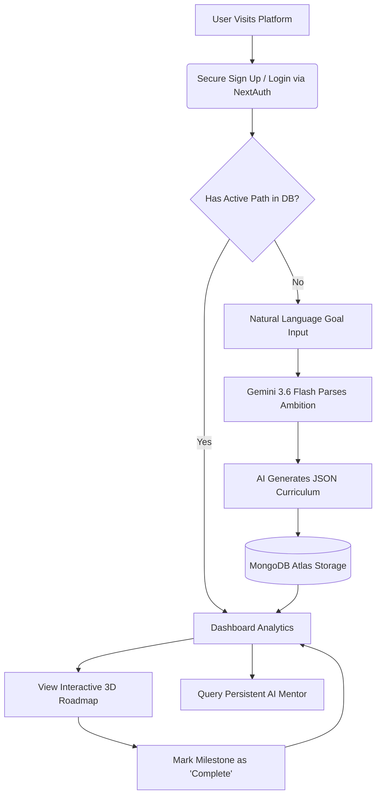
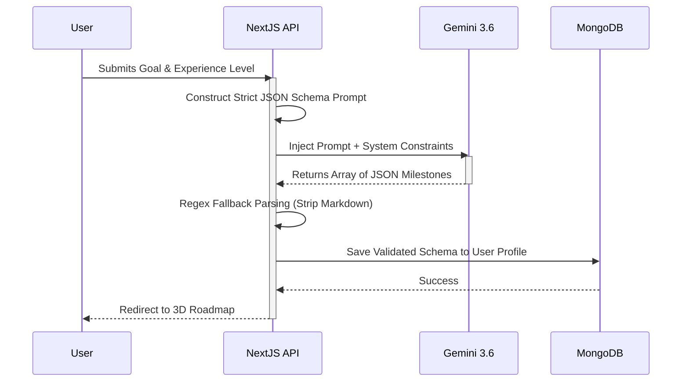
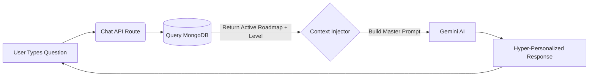

<div align="center">
  
  <h1>🚀 LearnSync AI</h1>
  <p><strong>Your Ultra-Personalized, AI-Powered Learning Companion</strong></p>
  
  [](https://learnsync-56nlakpb4-krishnaadubey2005-8466s-projects.vercel.app)
  
  <div>
    
    
    
    
    
    
  </div>
</div>

---

<div align="center">
  <table>
    <tr>
      <td align="center">
        <h2>🏆 Official Submission for HCLTech AMPlified</h2>
        <p><strong>Season 1 • 2026 | The AI Challenge</strong></p>
        <p><i>"Build. Compete. Learn. Rise."</i></p>
        <p>This project was proudly conceptualized, designed, and engineered by team <b>KineticModifiers</b> for the Round 2 PathFinder Prototype challenge. We set out to compete against the brightest minds by solving a critical problem in modern education using cutting-edge Generative AI.</p>
      </td>
    </tr>
  </table>
</div>

---

## 📖 Table of Contents
1. [The Problem & Our Solution](#-the-problem--our-solution)
2. [Core Product Features](#-core-product-features)
3. [System Architecture & Data Flow](#-system-architecture--data-flow)
4. [AI Integration & Prompt Engineering](#-ai-integration--prompt-engineering)
5. [Database Schema Design](#-database-schema-design)
6. [API Endpoints Reference](#-api-endpoints-reference)
7. [Local Installation Guide](#-local-installation-guide)
8. [Future Roadmap & Scaling](#-future-roadmap--scaling)

---

## 🌟 The Problem & Our Solution

### The Core Problem: "Choice Paralysis"
The internet has democratized education, but it has also created an overwhelming ecosystem. Beginners are bombarded by thousands of bootcamps, outdated YouTube tutorials, and fragmented documentation. Without a personal mentor, students often:
- Learn the wrong skills in the wrong order.
- Lose motivation due to lack of structured progress.
- Experience "tutorial hell" without building real projects.
- Struggle to bridge the gap between their current skill level and their end goal.

### The LearnSync Solution
**LearnSync AI** disrupts the traditional learning management system (LMS) paradigm by acting as a highly intelligent, 24/7 personal mentor. Rather than presenting static, generic lists of courses, the platform functions as an active orchestrator of the user's educational journey. 

It dynamically generates **highly personalized, step-by-step learning roadmaps** based on a user's exact interests, current experience level, and ultimate career goals. LearnSync curates hyper-specific milestones, tracks progress in real-time, and provides an integrated AI chat interface to explain complex concepts natively.

---

## 🚀 Core Product Features

### 1. 🧠 Dynamic AI Onboarding & Goal Parsing
Users bypass complex, rigid forms. They simply describe their career ambitions and current constraints in natural language. This data is sent to a custom Next.js API route where it is packaged into a highly specific prompt. The prompt is processed by Google's cutting-edge `gemini-3.6-flash` AI model, which generates a strictly typed JSON structure containing a comprehensive, multi-step curriculum.

### 2. 🗺️ Interactive 3D Roadmap Generation
We built a visually stunning, Framer Motion-powered timeline. The timeline visually "draws" itself as you load the page, and milestone cards pop into view sequentially utilizing 3D transform physics. Each milestone contains:
- Theoretical concepts to master.
- Actionable project ideas.
- An estimated time to completion.

### 3. 💬 Context-Aware AI Mentor (RAG-Lite)
Learning isn't just about reading a list of topics; it's about asking questions. We integrated a persistent AI Assistant chat interface directly into the platform. When a user asks a question, the API silently queries MongoDB for their exact active learning path and current skill level, and injects this context into the system prompt. The AI Mentor answers questions specifically tailored to the user, bridging skill gaps organically without breaking the user's workflow.

### 4. 📊 Action-Oriented Dashboard
Avoids data overload by calculating macro progress metrics while isolating and highlighting a single **"Next Recommended Action"**, keeping cognitive load to an absolute minimum and keeping the learner moving forward.

### 5. ✨ Premium Glassmorphism UI & Physics
To stand out in the HCLTech challenge, the UI had to be flawless. The dark mode features a mesmerizing, physics-simulated Aurora Glowing Mesh. Components scale slightly on interaction, projecting deep shadows and reflecting the glowing background, achieving seamless 60fps performance without heavy WebGL overhead.

---

## 🏗️ System Architecture & Data Flow

To ensure high performance, responsiveness, and secure data handling, we engineered a scalable, full-stack application.

### User Journey & Core Loop
This flowchart maps how a user moves from an initial idea to executing a structured curriculum.



### Serverless Infrastructure
- **Frontend:** Built with Next.js (React) for optimized rendering and routing. Styled utilizing Tailwind CSS for utility-first responsive design.
- **Backend:** Leverages Next.js Serverless API Routes to maintain a lightweight, instantly scalable backend infrastructure that tightly couples with the frontend components.
- **Database:** Operates on MongoDB Atlas utilizing the Mongoose ODM. The schema-less nature of NoSQL perfectly accommodates the highly variable, nested JSON structures of the AI-generated curriculums.
- **Security:** Implemented via NextAuth.js. We utilize secure, stateless JWT (JSON Web Token) session handling, paired with bcryptjs for rigorous password hashing and encryption.

---

## 🤖 AI Integration & Prompt Engineering

### Intelligent Onboarding Generation
How we force a Large Language Model to return structured, predictable data for our UI.



### Context-Aware Mentor Workflow
How the chat assistant "knows" exactly what the user is currently learning without being explicitly told.



---

## 🗄️ Database Schema Design

Our MongoDB database is structured using strict Mongoose schemas to ensure data integrity while allowing for the flexibility of AI-generated content.

### `User` Collection
Stores authentication details and links to the user's specific learning paths.
- `_id`: ObjectId
- `name`: String
- `email`: String (Unique)
- `password`: String (Hashed via bcrypt)
- `learningPaths`: Array of ObjectIds (Ref: LearningPath)

### `LearningPath` Collection
The core structure generated by the AI for a specific user.
- `_id`: ObjectId
- `userId`: ObjectId (Ref: User)
- `goal`: String (e.g., "Become a Senior React Developer")
- `experienceLevel`: String (e.g., "Beginner")
- `milestones`: Array of Milestone Sub-documents
- `progress`: Number (0-100 percentage)
- `createdAt`: Date

### `ChatMessage` Collection
Maintains the history of interactions between the user and the AI Mentor.
- `_id`: ObjectId
- `userId`: ObjectId (Ref: User)
- `role`: String ('user' or 'ai')
- `content`: String
- `timestamp`: Date

---

## 🔌 API Endpoints Reference

The application relies on several secure, serverless API routes under the `/api/` path. All routes are protected and require a valid NextAuth JWT session token.

| Endpoint | Method | Description | Payload |
|----------|--------|-------------|---------|
| `/api/auth/register` | `POST` | Registers a new user and hashes their password. | `{ email, password, name }` |
| `/api/auth/[...nextauth]` | `GET/POST` | Handles NextAuth authentication workflows and session management. | *Managed by NextAuth* |
| `/api/onboarding` | `POST` | Triggers Gemini API to generate a custom curriculum and saves it to MongoDB. | `{ goal, experienceLevel, interests }` |
| `/api/dashboard` | `GET` | Fetches the user's active learning path and calculates completion metrics. | *Requires Session* |
| `/api/milestone` | `PUT` | Toggles the completion status of a specific milestone in the database. | `{ milestoneId, isCompleted }` |
| `/api/chat` | `POST` | Injects the user's roadmap context into the prompt and streams an AI response. | `{ messages }` |

---

## 💻 Local Installation Guide

Want to run LearnSync's architecture on your own machine? Follow these simple steps:

### 1. Clone the Repository
```bash
git clone https://github.com/krrish-cypto/learnsync-ai.git
cd learnsync-ai
```

### 2. Install Dependencies
Ensure you are using Node.js v18 or higher.
```bash
npm install
```

### 3. Setup Environment Variables
Create a `.env` file in the root directory and configure the following required keys:
```env
# MongoDB Connection String (Set up a free cluster on MongoDB Atlas)
MONGODB_URI="mongodb+srv://<username>:<password>@cluster0.mongodb.net/learnsync"

# Google Gemini API Key (Get from Google AI Studio)
GEMINI_API_KEY="your-gemini-api-key"

# NextAuth Secret (Generate a random string for JWT Encryption)
NEXTAUTH_SECRET="your-super-secret-key-12345"

# Deployment URL (Required for production NextAuth)
NEXTAUTH_URL="http://localhost:3000"
```

### 4. Start the Development Server
```bash
npm run dev
```
Open [http://localhost:3000](http://localhost:3000) in your browser. The application will automatically connect to your database and initialize the AI configurations.

---

## 🔮 Future Roadmap & Scaling

While the current prototype is fully functional for the HCLTech AMPlified Hackathon, we have an expansive vision for the future of LearnSync AI:

1. **YouTube & Udemy Integration:** Directly parsing the generated milestones and querying the YouTube Data API to embed free, highly-rated video tutorials directly inside the milestone cards.
2. **Automated AI Quizzing:** Once a user marks a milestone as "Complete", the AI generates a dynamic 5-question quiz to ensure true retention before allowing them to move to the next stage.
3. **Community Leaderboards:** Gamifying the learning experience by allowing users with similar goals to compete on progress metrics, turning solitary learning into a social, motivating experience.
4. **Export to Notion/PDF:** Allowing users to export their generated curriculums to external productivity tools via API integrations.

---

<div align="center">
  <h3>Engineered for the HCLTech AMPlified Challenge by</h3>
  <h2>🚀 KineticModifiers</h2>
  <p>Krishna | 2026</p>
</div>
