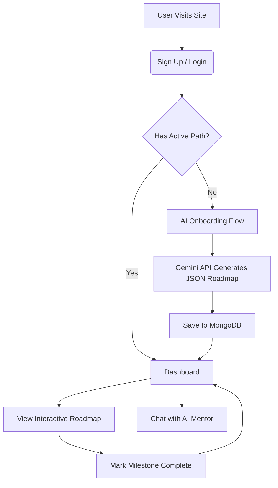

<div align="center">
  
  <h1>🚀 LearnSync AI</h1>
  <p><strong>Your Ultra-Personalized, AI-Powered Learning Companion</strong></p>
  
  [](https://learnsync-56nlakpb4-krishnaadubey2005-8466s-projects.vercel.app)
  
  <div>
    
    
    
    
    
  </div>
</div>

---

## 🌟 What is LearnSync?
LearnSync AI is a next-generation educational platform that dynamically generates **highly personalized, step-by-step learning roadmaps** based on a user's exact interests, experience level, and ultimate career goals. 

Instead of generic courses, LearnSync acts as a 24/7 AI Mentor that curates hyper-specific milestones, tracks your progress in real-time, and provides an integrated AI chat interface to explain complex concepts on the fly.

---

## 🛠️ Key Features
- **🧠 Dynamic AI Onboarding:** A smart questionnaire that captures your goals and generates a JSON-structured curriculum using Google's cutting-edge Gemini model.
- **🗺️ Interactive 3D Roadmap:** A visually stunning, Framer Motion-powered timeline that visually "draws" itself as you progress through milestones.
- **💬 Context-Aware AI Mentor:** A persistent chat interface that *knows* what path you are on and answers questions natively within your specific learning context.
- **🔒 Secure Authentication:** Handled via NextAuth with fully encrypted credentials and MongoDB session persistence.
- **✨ Premium Glassmorphism UI:** An immersive, fluid user interface featuring physics-based interactions and an animated glowing Aurora background.

---

## 🏗️ Architecture & Workflow

### User Flow Diagram


### Folder Structure
```text
📦 learning-path-recommender
 ┣ 📂 src
 ┃ ┣ 📂 app
 ┃ ┃ ┣ 📂 api         # Next.js Serverless API Routes (Auth, Chat, Roadmap)
 ┃ ┃ ┣ 📂 chat        # AI Mentor Chat Interface
 ┃ ┃ ┣ 📂 dashboard   # User Progress Dashboard
 ┃ ┃ ┣ 📂 onboarding  # AI Goal Collection Flow
 ┃ ┃ ┗ 📂 roadmap     # Interactive Timeline View
 ┃ ┣ 📂 components    # Reusable React UI Components (Sidebar, Badges)
 ┃ ┣ 📂 lib           # Utilities (MongoDB Connection, Gemini API Fallbacks)
 ┃ ┗ 📂 models        # Mongoose Database Schemas (User, Milestone, Chat)
 ┣ 📜 globals.css     # Premium UI styling and Aurora Mesh animations
 ┗ 📜 .env            # Environment Variables
```

---

## 🚀 How to Run Locally

Want to run LearnSync on your own machine? Follow these simple steps:

### 1. Clone the Repository
```bash
git clone https://github.com/krrish-cypto/learnsync-ai.git
cd learnsync-ai
```

### 2. Install Dependencies
```bash
npm install
```

### 3. Setup Environment Variables
Create a `.env` file in the root directory and add the following:
```env
# MongoDB Connection String
MONGODB_URI="mongodb+srv://<username>:<password>@cluster0.mongodb.net/learnsync"

# Google Gemini API Key
GEMINI_API_KEY="your-gemini-api-key"

# NextAuth Secret
NEXTAUTH_SECRET="your-super-secret-key"
```

### 4. Start the Development Server
```bash
npm run dev
```
Open [http://localhost:3000](http://localhost:3000) in your browser to see the magic happen! ✨

---

## 🎯 How to Use It
1. **Sign up** for a new account.
2. Complete the **Onboarding** by telling the AI your goals (e.g., "I want to become a Senior React Developer").
3. Navigate to **My Path** to view your freshly generated, interactive learning timeline.
4. Dive into a milestone, read the recommended resources, and click **Mark Complete**.
5. Stuck on a topic? Head over to the **AI Assistant** tab and ask your mentor to explain the concept to you!

---

<div align="center">
  <h3>Built with ❤️ for the Hackathon by</h3>
  <h2>🚀 KineticModifiers</h2>
</div>
