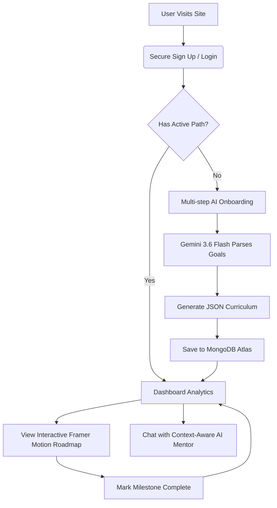

<div align="center">
  
  <h1>🚀 LearnSync AI</h1>
  <p><strong>Your Ultra-Personalized, AI-Powered Learning Companion</strong></p>
  
  [](https://learnsync-56nlakpb4-krishnaadubey2005-8466s-projects.vercel.app)
  
  <div>
    
    
    
    
    
  </div>
</div>

---

## 🏆 Hackathon Submission
This project was proudly conceptualized, designed, and engineered by team **KineticModifiers** for the 2026 Hackathon. We set out to compete against the brightest minds from top-tier colleges by solving a critical problem in modern education: the overwhelming nature of unstructured learning. Our solution bridges the gap between raw information and structured, personalized education using cutting-edge Generative AI and a premium, physics-based user interface.

---

## 🌟 The Problem & Our Solution
**The Problem:** The internet has democratized education, but it has also created "choice paralysis". Beginners are overwhelmed by thousands of bootcamps, scattered YouTube videos, and outdated roadmaps. Without a personal mentor, students often learn the wrong skills, lose motivation, and quit.

**The Solution:** LearnSync AI is a next-generation educational platform that acts as a highly intelligent, 24/7 personal mentor. It dynamically generates **highly personalized, step-by-step learning roadmaps** based on a user's exact interests, current experience level, and ultimate career goals. Instead of feeding users a generic list of courses, LearnSync curates hyper-specific milestones, tracks progress in real-time, and provides an integrated AI chat interface to explain complex concepts on the fly.

---

## 🛠️ Deep Dive: Features & Functionality

### 1. 🧠 Dynamic AI Onboarding & Goal Parsing
The user journey begins with a smart, multi-step onboarding questionnaire. Users input their core interests (e.g., Data Science, Web3), their current experience level, and their long-term goals. 
- **Under the Hood:** This data is sent to a custom Next.js API route where it is packaged into a highly specific prompt. The prompt is processed by Google's cutting-edge `gemini-3.6-flash` AI model, which generates a strictly typed JSON structure containing a comprehensive, multi-step curriculum. 
- **Fallback Redundancy:** We engineered a robust fallback mechanism. If the AI rate limit is hit, the system gracefully degrades to backup models to ensure the user is never left with a broken screen.

### 2. 🗺️ Interactive 3D Roadmap Generation
Once the AI generates the curriculum, the data is saved to a MongoDB Atlas cluster and rendered on the **My Path** page.
- **The UX:** We built a visually stunning, Framer Motion-powered timeline. The timeline visually "draws" itself as you load the page, and milestone cards pop into view sequentially.
- **Actionable Steps:** Each milestone contains theoretical concepts, required skills, and an estimated time to completion. Users can click "Mark as Complete", which updates their database record in real-time and updates the progress metrics on their Dashboard.

### 3. 💬 Context-Aware AI Mentor
Learning isn't just about reading a list of topics; it's about asking questions. We integrated a persistent AI Assistant chat interface directly into the platform.
- **Context Injection:** When a user asks a question, the API doesn't just send the raw text to Gemini. It intercepts the request, queries MongoDB for the user's current experience level, their exact learning path, and their goals, and injects this context into the system prompt.
- **Result:** The AI Mentor answers questions specifically tailored to the user's skill level. If a beginner asks about React, the AI uses simple analogies. If an advanced user asks, it dives into Virtual DOM reconciliation.

### 4. 🔒 Secure Authentication & Data Persistence
Security and data integrity are handled via `NextAuth.js`.
- **Encryption:** Passwords are fully hashed and salted using `bcryptjs` before being stored in the database.
- **Session Management:** We use JWT (JSON Web Tokens) to securely maintain the user's session state across the application, tying their unique `ObjectId` directly to their generated roadmaps and chat histories in MongoDB.

### 5. ✨ Premium Glassmorphism UI & Physics
To stand out in a competitive hackathon, the UI had to be flawless.
- **Aurora Mesh Environment:** We broke away from flat CSS. The dark mode features a mesmerizing, physics-simulated Aurora Glowing Mesh. Three massive glowing orbs slowly float, expand, and contract behind the application panels, giving a 3D-depth effect.
- **Micro-interactions:** Every button and glass-panel features hover-physics. Components scale slightly on interaction, projecting deep shadows and reflecting the glowing background, achieving a seamless 60fps performance without heavy WebGL.

---

## 🏗️ Architecture & Workflow Algorithm

### User Flow Diagram


### Advanced Folder Structure
```text
📦 learning-path-recommender
 ┣ 📂 src
 ┃ ┣ 📂 app
 ┃ ┃ ┣ 📂 api               # Serverless API Routes
 ┃ ┃ ┃ ┣ 📂 auth            # NextAuth credential verification
 ┃ ┃ ┃ ┣ 📂 chat            # Context-injection & AI generation
 ┃ ┃ ┃ ┣ 📂 dashboard       # Metric calculations
 ┃ ┃ ┃ ┗ 📂 onboarding      # Gemini Prompt Engineering logic
 ┃ ┃ ┣ 📂 chat              # Chat UI & Markdown rendering
 ┃ ┃ ┣ 📂 dashboard         # Progress tracking UI
 ┃ ┃ ┣ 📂 onboarding        # State-driven questionnaire
 ┃ ┃ ┗ 📂 roadmap           # Timeline mapping & Framer variants
 ┃ ┣ 📂 components          # Reusable React components (Sidebar, Loaders)
 ┃ ┣ 📂 lib                 # Core utilities (Mongoose connection pooling)
 ┃ ┗ 📂 models              # Strict Mongoose Schemas (User, Milestone, Chat)
 ┣ 📜 globals.css           # Aurora animations and Glassmorphism design tokens
 ┗ 📜 .env                  # Environment Variables (Ignored in Git)
```

---

## 🚀 Local Installation & Setup

Want to run LearnSync's architecture on your own machine? Follow these simple steps:

### 1. Clone the Repository
```bash
git clone https://github.com/krrish-cypto/learnsync-ai.git
cd learnsync-ai
```

### 2. Install Dependencies
```bash
npm install
```

### 3. Setup Environment Variables
Create a `.env` file in the root directory and add the following required keys:
```env
# MongoDB Connection String (Set up a free cluster on MongoDB Atlas)
MONGODB_URI="mongodb+srv://<username>:<password>@cluster0.mongodb.net/learnsync"

# Google Gemini API Key (Get from Google AI Studio)
GEMINI_API_KEY="your-gemini-api-key"

# NextAuth Secret (Used for JWT Encryption)
NEXTAUTH_SECRET="your-super-secret-key"
```

### 4. Start the Development Server
```bash
npm run dev
```
Open [http://localhost:3000](http://localhost:3000) in your browser. The application will automatically connect to your database and initialize the AI configurations.

---

## 🎯 Navigating the Platform
1. **Create an Account:** Register securely. Your credentials will be hashed and stored.
2. **Define Your Future:** Complete the Onboarding flow. Be as specific as possible (e.g., "I want to master Python for quantitative finance").
3. **Analyze Your Dashboard:** View your overall progress metrics and determine what your next immediate action should be.
4. **Follow the Roadmap:** Navigate to **My Path**. Read through the AI-generated milestones, complete the required learning, and click **Mark Complete** to watch your progress bar fill up.
5. **Get Unstuck:** If you don't understand a milestone, open the **AI Assistant** tab. Ask your mentor to explain the concept to you, and it will respond intelligently based on your exact position in the roadmap.

---

<div align="center">
  <h3>Engineered by</h3>
  <h2>🚀 KineticModifiers</h2>
</div>
